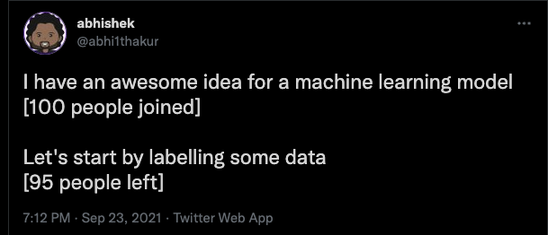
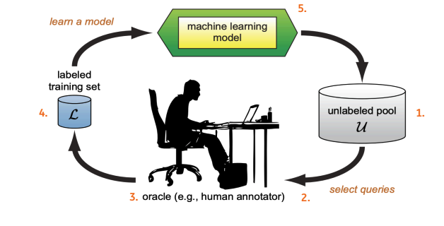

# Active Learning

I came across this [interesting tweet](https://twitter.com/abhi1thakur/status/1441088040873578500)

Though it is meant as a joke, there is quite some truth to it.

In the my previous projects too this approach of labelling data was quite useful.
The branch of machine learning that deals with labelling data is called Active Learning.
Though it is quite a vast field, I will try to provide a summary of the most frequent(read easy) methods used,some learning and ofcourse links to different resources.

## Active learning(AL) aka Query Learning

Active learning (sometimes called “query learning” or “optimal experimental design” in the statistics literature) 
is a subfield of machine learning and, more generally, artificial intelligence. The key hypothesis is that if the learning algorithm is allowed to choose the data from which it learns—to be “curious,” if you will—it will perform better with less training.

An AL process typically consists of the following steps:

1. Having access to an pool of unlabeled data.
2. Labelling either by randomly sampling the data or filtering based on some rules, then labelling the data.
3. Creating a ML model based on the labelled data.
4. Scoring the remaining the dataset with the model trained in step 3.
5. Choosing the *best* datapoints to label next and continuing stpes 3-5.
6. Stopping , when a stopping criteria is achieved.

From my experience the crux of AL lies in steps 2. i.e how to bootstrap the process and step 4. how to choose the best samples for labelling.

### Begin Labelling

Once you have the unlabelled dataset and a defintion of what a class looks like (e.g dog vs cat), the easiest way to start is to randomly select a sample and label them.
However, if the dataset has a high class imbalance, then randomly selections will not yield many samples of the minority class. 
In such cases, you should start with simple rules, rules that have a high chances yielding the class of interest. 

Unsupervised clustering can also be used. Then you can assign a label to an cluster and move ahead.

Once a decent number of samples have been labelled, you can train any classifier on this labelled set and score the unlabelled set.

### Chosing points for labelling:

Once you have scored the remaining unlabelled datapoints, next step is to label points that :

* either move the decision boundary of the classifier the most  or 
* improve the loss metric the most.

To achive this you can many methods, however the most simple ones being :

#### Uncertainity Sampling:

Consider a binary classification problem. You have created an intial labelling set and trained a ML model as mentioned in steps 1-3 above.
After scoring the unlabeled set, you choose the data points to label, for which the model is the least confident.
i.e the where the predicted probability is close to 0.5 (or median). Those the data points for which the model is least confident and will gain the most with human labelling/knowledge. 
Different variations of this technique are entropy sampling and margin sampling.

The main disadvantages of such methods are that they are prone to get stuck in a localised region of problem space and are also prone to outliers.
The next methods tries to resolve this disadvantages.

#### Query based sampling :

In the query based sampling method, you train multiple classifiers from diffrent family of classifiers. They choose the points for human labelling where most of the classifiers disagree.
This is slighly complex methods, but has some advantages over uncertainity sampling. 

### Combination of sampling methods:

It is advised to start with random / query-based sampling can usedfor cold start when no classifier is available.
Then one can move to more sophisticated approaches. You can also multiple methods.

### Stopping criteria:

The AL process can be stopped when :

1. The allocated budget is over, i.e either the time/ resources assigned to for AL are exhausted.
2. The model KPI is reached.
3. Despite labelling more data points the final model preformance does not improve.

Though there are many libraries that help you to implement AL e.g [modal](https://modal-python.readthedocs.io/en/latest/), [ALipy](https://github.com/NUAA-AL/ALiPy)
I found it easiser to create an custom interface in [streamlit](https://streamlit.io/) and implement various sampling methods.

I have used AL in a few some projects with good success, main among them are :

1.AL was used to [solve a cold start problem in NLP](youtube.com/watch?v=oyMawG0SlPU) for ING.
2.Dataset used to train the [ESR Bot](https://twitter.com/bot_esr) was created using AL.
This twitter bot tweets about the various environment related news to spread awareness.

Another package that uses AL is [Deduplipy](https://www.deduplipy.com/) created by [Frits Hermans](https://www.linkedin.com/in/frits-hermans-data-scientist/). 
It implements deduplication using active learning.

If you interested to use active learning in your project or have any questions/feedback about this blog [do reach out](../about.md)

## References

1. [Survey of Active Learning approaches](http://burrsettles.com/pub/settles.activelearning.pdf)
2. [Pycon DE 2018](https://www.youtube.com/watch?v=0efyjq5rWS4)
3. [Cold start problem for NLP](https://learning.oreilly.com/videos/strata-dataconference/9781492050520/9781492050520-video324208)- paywalled
4. [Active Learning webiste](http://active-learning.net/)