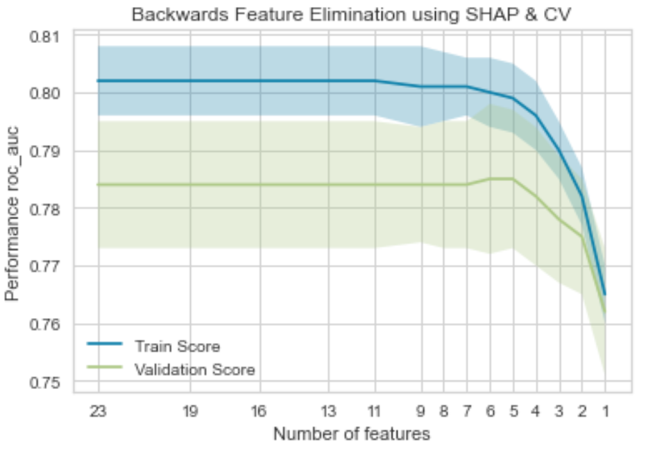
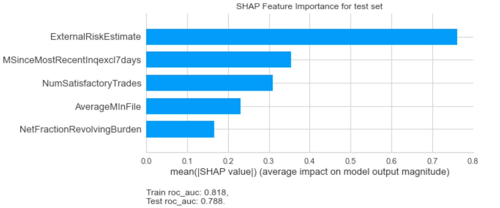
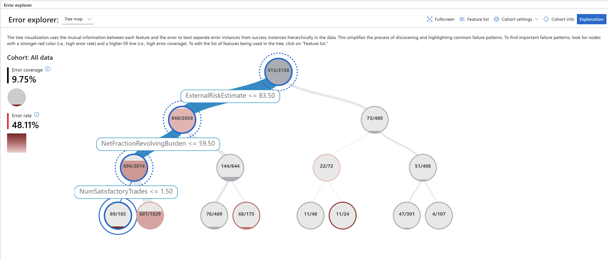
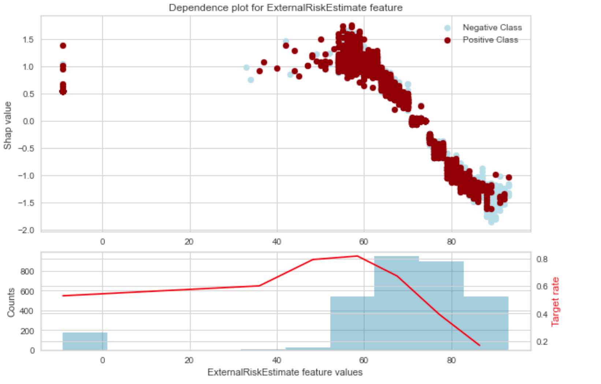
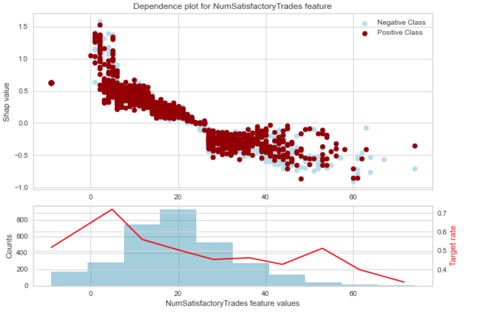

Error analysis simply means looking the misclassified data points and trying to infer why is the model making error on this subpopulation.
There are some great videos/blogs about how to do error analysis for text/image data. e.g [video by Andrew Ng](https://www.youtube.com/watch?v=JoAxZsdw_3w).

However I could not find anything related to error analysis for tablular data. One of the reason, I can think of is that it is intuitively diffcult to look at tabluar data and see if the model is misclassifying the data.
Sure there many python packages that help you to do that. e.g erroranalysis , mealy etc .However they are limited to showing you how to use the library and not how to use the error analysis methods to improve model performance. We will be using some of these in this blog post.

A model misclassifaction can be due to many reasons :

1. The data point has data quality issue. E.g loan given to a 300 year old person.
2. The data point is an outlier. E.g a very wealthy person defaulting on a small loan.
3. There are very few examples for the model to learn. E.g There are only 5 customers with an car loan, thus the model has not learnt much from this dataset.
4. Model bias : Due to the inherit limitations of the model,the classification hasn't been done correctly. E.g Linear model assumptions.

With error analysis we can identify which subset of the dataset the model is making the most mistakes and then try to improve upon it.
Thus we can look inot are the problematic features, and what are the typical values of these features for the mispredicted samples.
This information can later be exploited to support the improvement strategy. Which can one of the following as mentioned on the [Dataiku website](https://doc.dataiku.com/dss/latest/machine-learning/supervised/model-error-analysis.html)

1. Improve model design: removing a problematic feature, removing samples likely to be mislabeled, ensemble with a model trained on a problematic subpopulation;
2. Enhance data collection: gather more data regarding the most erroneous or under-represented populations;
3. Select critical samples for manual inspection thanks to the Error Tree, and avoid primary predictions on them using model assertions.

All of these are interesting options in this blog post I will focus on the 1 option. We will explore this via a ML model created on the HELOC dataset provied in the [FICO Explainability Challenge](https://community.fico.com/s/explainable-machine-learning-challenge).
The data and the metadata can be obtained by [filling this form](https://community.fico.com/s/explainable-machine-learning-challenge?tabset-158d9=3)

## Problem Statement

In this challenge we are tasked to predict the variable `RiskPerformance`. I will not go into detail about the problem and the predictor variables. You can read the details in the [FICO Explainability Challenge website](https://community.fico.com/s/explainable-machine-learning-challenge). 

The dataset is balanced with ~52% postive class and ~48% negative class.

## ML Model

Before error analysis,we need a model,so lets go ahead build one. We will make use of many packages to make our life easy. 
Main among them are [Probatus](https://ing-bank.github.io/probatus/index.html) for feature selection and analysis,[Yellowbrick](https://www.scikit-yb.org/en/latest/api/classifier/threshold.html) for decidicng threshold,[XGBoost](https://xgboost.readthedocs.io/en/latest/index.html) for classification and [erroranalysis](https://erroranalysis.ai/) for erroranalysis and offcourse scikit-learn for all other things.

### Train Test Selection

The dataset is divided in training and testing set with %30 of the samples in the test set.

### Feature Selection & HP Tuning

The ShapRFECV - Recursive Feature Elimination using SHAP importance from the Probatus is used for feature selection. As the name suggests it uses Shapley Values to eliminate features in a recurvise manner.

As the plot suggests, we can use only 5 features and achieve the maximum performance(roc-auc) in this case.

* `NetFractionRevolvingBurden`
* `NumSatisfactoryTrades`
* `AverageMInFile`
* `MSinceMostRecentInqexcl7days`
* `ExternalRiskEstimate`

Once the features are selected lets tune the parameters for the XGBClassifier.
The initial parameter grid is used as suggested in the book [Approaching (Almost) Any Machine Learning Problem](https://github.com/abhishekkrthakur/approachingalmost)

The model has the following performance.

|Training ROC-AUC| Test ROC-AUC| Test Accuracy|
|:--------------:|:------------:|:-----------:|
|0.818|0.787|0.71|

There is a slight overfit,however this is `decent` model for the purposes of this blog.

### Feature Importance

If we look at the SHAP feature importances we notice that `ExternalRiskEstimate` is the most predictive feature.

I have observed that in most cases, the feature impartances follow the Pareto 80:20 rule. That is 20% of the features provide 80% of the performance.
Hence if we can spot and rectify issues in the most important features, that chances of improvement is quite much.

## Error Analysis

So far so good. Now lets begin with error analysis. For this we will use `ErrorAnalysisDashboard` provided [Microsoft](https://erroranalysis.ai/).
The ouput of the `ErrorAnalysisDashboard` is a interactive wiget containing the error tree. There are many more functionalaties like the grid view,ability to exclude features from the error tree etc.
However I will skip that and focus on the use case which is improving the model via erroranalyis.
You can see other functionalaties provided by the package in the [examples notebooks](https://github.com/microsoft/responsible-ai-widgets/tree/main/notebooks)

To identifty important failure patterns, look for nodes with a stronger `dark red` (i.e., high error rate) and a higher fill line (i.e., high error coverage)

* Error coverage shows the percentage of errors that are concentrated in the selection out of all errors present in the dataset.
* Error rate represents the percentage of instances in the node for which the system has failed.

Ideally it makes sense to start the error analysis process by looking into these leaf nodes first.

For our usecase, we can see that for data points where `ExternalRiskEstimate <= 83.50` and `NetFractionRevolvingBurden <= 59.50` and `NumSatisfactoryTrades <= 1.50` the error rate is 48.11 % and the error coverage is 9.75%.

Next, lets look into these features and see if we can spot something, which look like either data quality or anamolies.

If we look the `ExternalRiskEstimate` feature, we notice that there are few data points with values < 0.
A `ExternalRiskEstimate` of less that 0 looks like a data quality issue and can be eliminated.

Similarly if we look at the `NumSatisfactoryTrades` feature, there are few datapoints with values < 0 .
Number of trades with values < 0 again seems like a data quality issue. We will eliminate these as well.

Once we remove the datapoints and rerun the model, we get the following model results.

|Training ROC-AUC| Test ROC-AUC| Test Accuracy|
|:--------------:|:------------:|:-----------:|
|0.822|0.805|0.73|

The model performance has improved! 

Similarly one can look at other variable/s and identify datapoints leading to error and treat them.
In this example, we eliminated the data points, however in your own use case these points colud be treated differenlty based on business knowledge.

Apart from the library used above,[mealy](https://github.com/dataiku-research/mealy) is another library that can be used for error analysis.

The notebook and code for reproducing the above results can be found in [my github account](https://github.com/anilkumarpanda/erroranalysis/blob/main/notebooks/error_analysis.ipynb).

