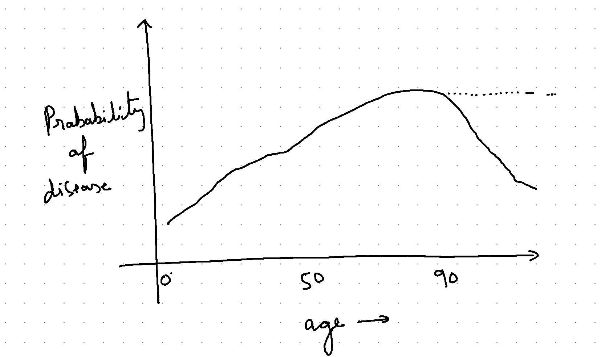

[Generalised Additive Models](https://www.youtube.com/watch?v=XQ1vk7wEI7c) represents a class of machine learning models, that can often match boosting models in performance, but are interpretable.
Not only that, they can incorporate business knowledge easily, which is sometimes lacking in boosting models.

What do I mean by that ?

All machine learning models learn from data. Based on the data provided, these model learn co-relation between features and target.
However many a times it happens that, for a particular feature the model learns a relationship that is not intuitive.
There are two possible reasons this may happen.

1. The relationship between that feature and target is exactly as the model has learnt, it may not be intuitive, nevetheless it is true.
2. Due to data available training sample, the model learns a relationship that is not true in the real world.

Consider the example, where we are trying to predict the probability of getting a disease X based on the age of patient. We see that as age increases, the probability of getting X increases as well. However we see a drop after 90 year of age. This can be

* a) true effect observed in the real world.
* b) or while training the model, there were not many participants in the > 90 years age bucket with the X.Thus the model has learnt that for customers with age > 90, the chances of getting that disease is less.

After talking to subject matter experts, we conclude that indeed 2 scenario is the case. They inform us that with increasing age the chances of getting X in higher or at-least as high as when age is between 80-90.

As a data scientist, we are not required to incorporate this information into the model.There a few ways of doing it.

1. Manual overrides : Since we don't have the data and the relationship model has learnt is not correct, we can manually decide to override the predictions by the model.
2. Constraint the model : Enforce certain constraints in the model learning, that the this business rule can be incorporated.

In this blog post, we will explore the second option and see how we can edit an EBM model, to incorporate this information.

To be continued...
