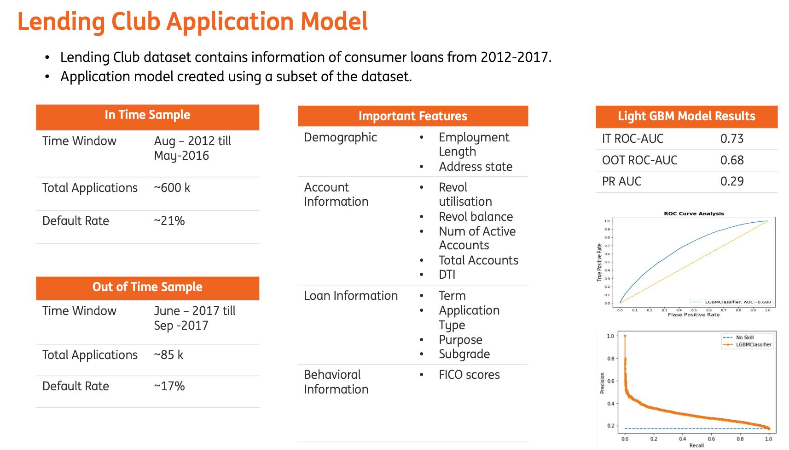
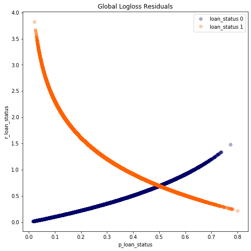
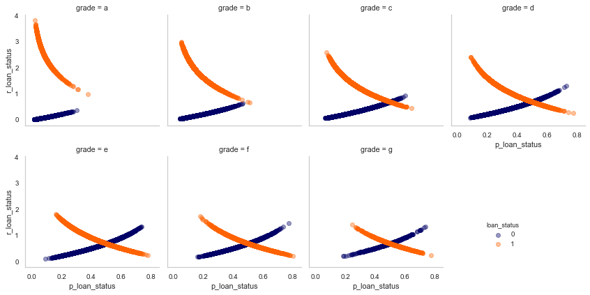
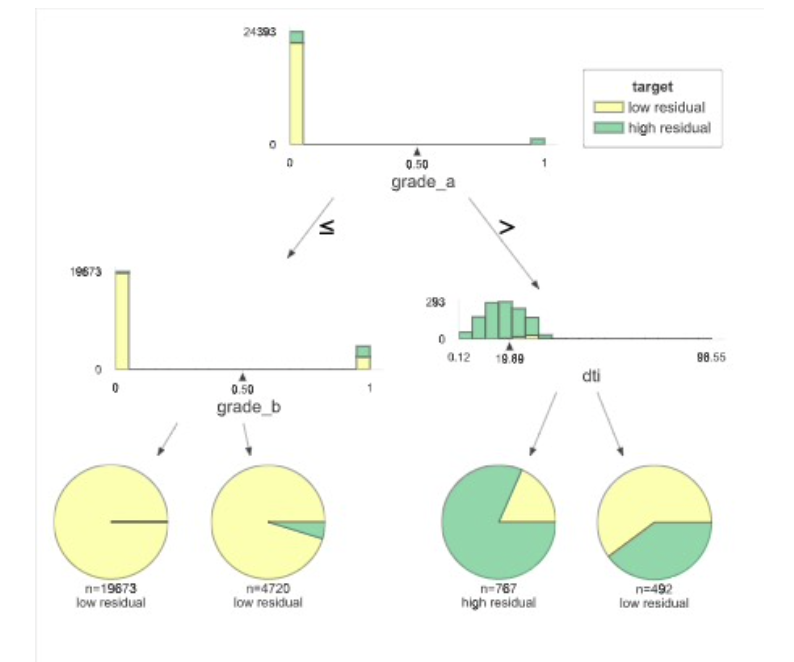

Residuals refer to the difference between the recorded value of a dependent variable and the predicted value of a dependent variable for every row in a data set. Plotting the residual values against the predicted values is a time-honoured model assessment technique and a great way to see all your modelling results in two dimensions.

Analysing residuals can provide us with great insights about the model behaviour both on a global level and also on a feature level.It can reveal insights such about the data points for which our model is making mistakes.

I will explore two methods for residual analysis:

1. Residual analysis on global & feature level
2. Modelling of residuals

For demonstration purposes, I will explore the model created on Lending Club data.The data is available on [Kaggle](https://www.kaggle.com/datasets/wordsforthewise/lending-club).The task is to create a binary classification model, to predict loan defaults at the time of loan origination. Such models are also known as Application models/score models.

A lightgbm model was created. The details of the model can be found below.

Now that we have a model, lets start with the residual analysis.

### Residual Analysis on Global Level

Here I will explore the model behaviour on the global level. The plot shows the model residuals against the actual values(classes) of the dependent variable.

We see that indeed the model is making quite a few mistakes(large residuals). Especially for `loan_status==1`. This raises a few interesting questions :

* Who are these customers?
* Why is the model so wrong about them?
* Are they somehow exerting undue influence on other predictions?

To answer these questions we can also conduct residual analysis on the feature level.

### Residual Analysis on Feature Level

In this method, we will plot the residuals against the predicted values of the dependent variable for each feature(or at-least a few important features).
In our case, let us take the example of the `grade` feature.

Intuitively ,higher the grade, less chances of default. However on closer analysis we see that the model is making mistakes for the customers who have a grade of `A` or `B` i.e providing high residuals.

This is an interesting observation. That means that the model is making more errors if an application has as higher assigned grade.
A similar analysis can also be done for numerical features, where we bin the variable and look at the residuals for each bin.

Residuals analysis on feature level can be used to understand the model behaviour in an univariate way.
Can we identity more such failure modes for the model? A definite pattern in which the model is making mistakes?

### Modelling of Residuals

Modelling residuals with interpretable models is another great way to learn more about the mistakes your AI system could make. e.g A decision tree model of the example ML model’s residuals for loan_default = 1, or customer’s who default. While it reflects what was discovered before, it does so in a very direct way that exposes the logic of the failures.In fact, it’s even possible to build programmatic rules about when the model is likely to fail the worst.

* model shows high residuals when the loan `Grade = A and DTI <= 20` essentially when a `good looking` application fails.

* this indicates that only the above features are not good enough. We need to create features that deal with deeper customer behaviours.

To summarise, the residual analysis is a great way to understand the model behaviour. These simple plots can help you uncover pockets of data that are likely to be the cause of the model’s failure.
Once you identify these you can either

1. Analyse the default rates in grade A, B, C where the DTI is less than 20.
It could also be that, most of the defaults are of applications of lower grade.
Thus the ML models provides more weightage to those defaults. Providing higher weights to defaults with grade A,B,C could help.
Which indeed is the case, when we provide more weightage to applications from grade A,B,C compared to others. The performance of the model increases slightly from 0.68 to 0.69.
2. Engineer new features
3. Collect more data wherever possible
4. Create business rules at inference time.

#### Further Analysis

The code to produce the plots can be found in the [repo](https://github.com/anilkumarpanda/blog_series/blob/master/notebooks/02_residual_analysis.ipynb)

A big shout out to [Patrick Hall](https://github.com/jphall663) for the great work on [model debugging](https://nbviewer.org/github/jphall663/GWU_rml/blob/master/lecture_5.ipynb).
