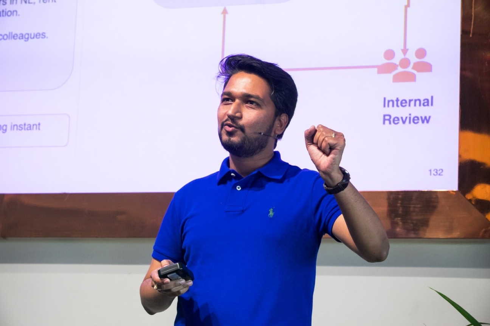
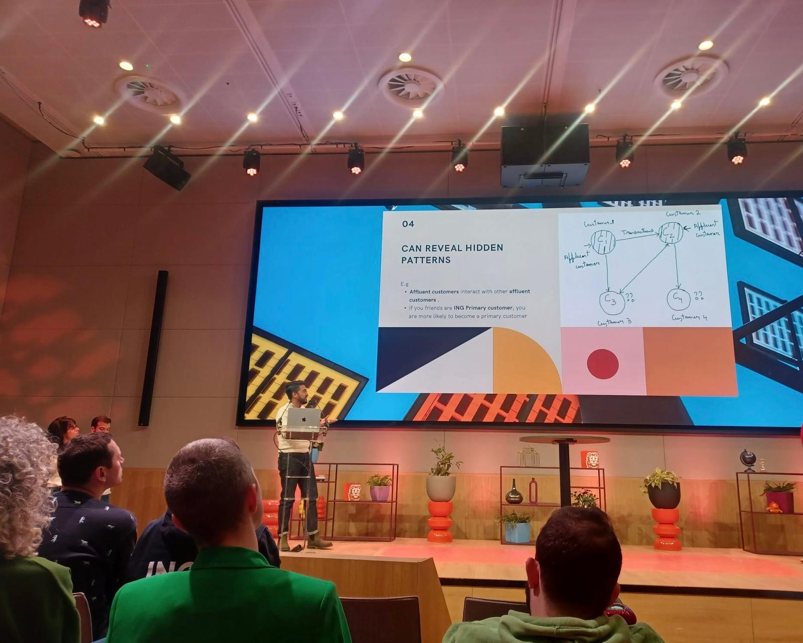
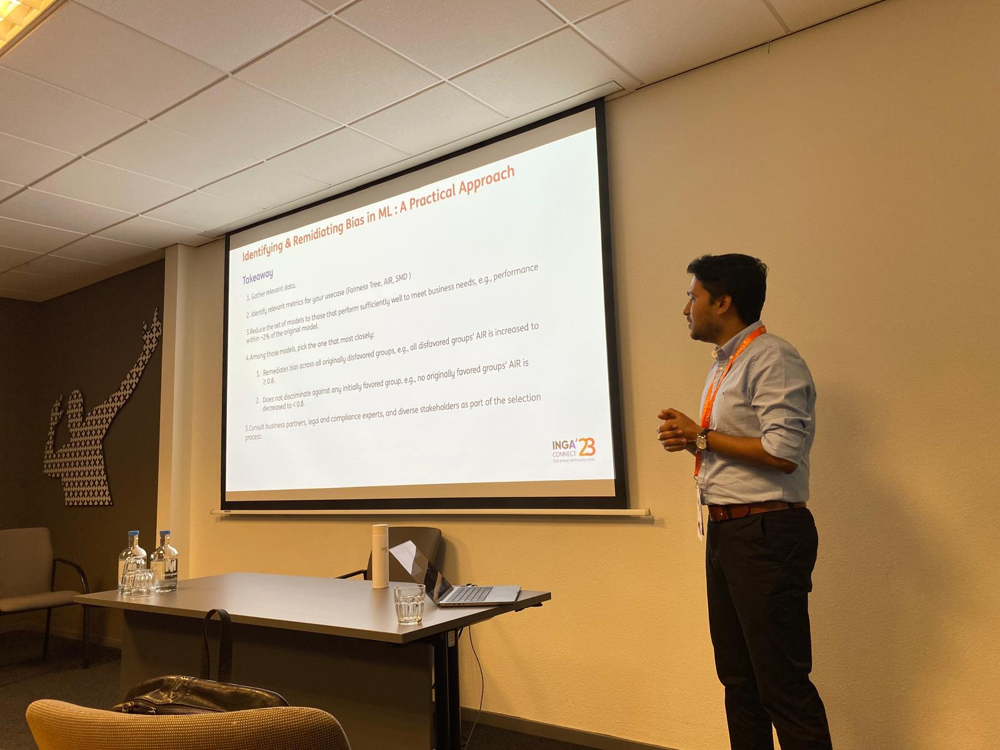
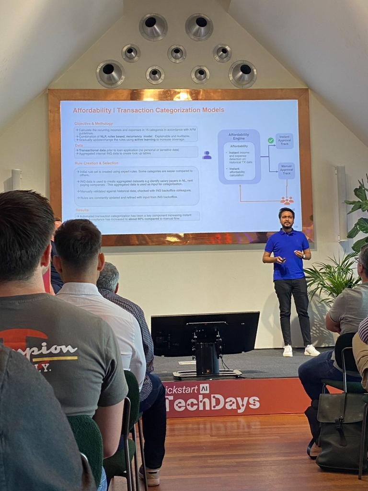
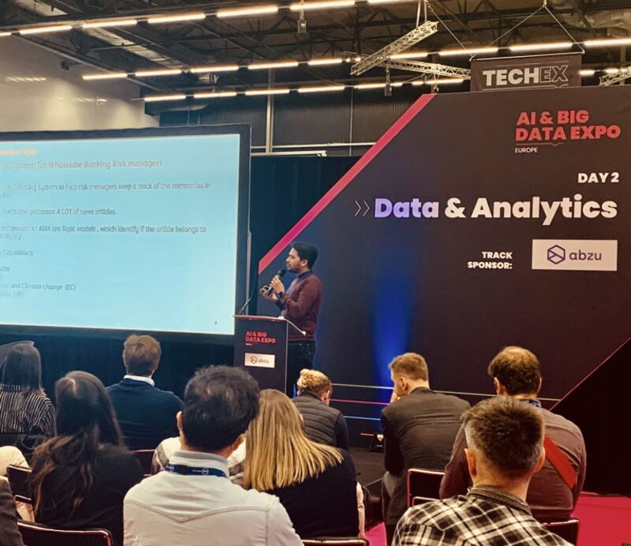

As a part my work, I also share my learnings via talks and presentations. You can find a few of them below.

* ## ING - Experimentation Days

    

    Date : 26th March 2024

    Topic : [Graph Data for Machine Learning Models](presentations/GRAPHDatainML.pdf)

* ## ING-Analytics Connect

    

    Date : 6th Sept 2023

    Topic : Identifying and Mitigating Bias in Machine Learning Models : A Practical Approach

* ## Kick Start AI Summer Edition 2023

    

    Date : 6th July 2023

    Topic : Enabling Instant Lending at ING

* ## DSFC : 2nd Edition

    Date : 14th Apr 2022

    Topic : [Debugging Machine Learning Models](https://drive.google.com/file/d/14pdTGLGjiiPIbXWQVBvZQHEYX0XgrYAe/view?usp=sharing)

* ## AI & Big Data Expo, Amsterdam

    

    Date : 23rd Nov 2021

    Topic : Active Learning : Solving a cold start problem in NLP.

* ## DSFC : 1st Edition

    Date : Apr 2021

    Topics :
  * [Active Learning : Solving a cold start problem in NLP](https://drive.google.com/file/d/14pdTGLGjiiPIbXWQVBvZQHEYX0XgrYAe/view?usp=sharing).
  * Introduction to Fairness in ML

* ## ING : Data Science Meetup

    Date : 18th March 2021

    Topic :[Active Learning : Solving a cold start problem in NLP.](https://www.youtube.com/watch?v=Zvet4uk0F8U)

* ## ING : Data Science Meetup

    Date : 28th Apr 2020

    Topic : [Knockout Rule Optimisation using NSGA-II.](https://www.youtube.com/watch?v=XnpbLmPVov8)
